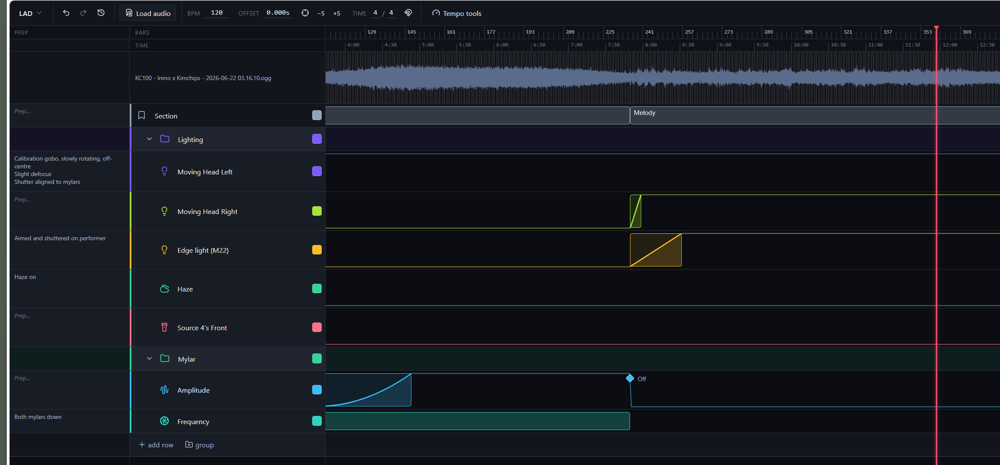

# Cue Timeline

A browser-based timeline editor for **planning show cues against a piece of music**. Load
one audio track, lay out a bar/beat grid, and annotate it with stacked rows of cues —
ranged blocks, point cues, and value-automation curves — so every lighting, sound,
projection, or stage action has an exact place in the music.

It runs entirely in the browser. The core editor works offline as a static app and saves
your work locally; an optional cloud mode adds shareable links, immutable snapshots, and
live multi-person editing.



## What it's for

Anything where you need to choreograph events to a fixed piece of audio and hand the result
to other people (or your future self):

- **Theatre & live-show lighting plots** — one row per fixture or group (moving heads, edge
  lights, haze, Source Fours…), with a prep-cue note for the state each fixture should be in
  *before* the scene, and curves for fades and intensity ramps. This is the workflow in the
  screenshot above.
- **Stage / performance calling sheets** — mark sections ("Intro", "Melody", "Drop"), bar
  numbers, and timed actions so an operator or stage manager can follow along and call cues.
- **Projection mapping & AV** — sequence content changes, transitions, and triggers to the
  soundtrack before wiring them into your media server.
- **Music & arrangement annotation** — sketch structure, mark transitions, and note
  per-section ideas against the waveform with a corrected bar grid.
- **Dance, circus, and devised work** — block movement and technical moments to counts and
  timecode, then share a read-only link with the company.

The output is a single self-contained `*.cuetl.json` project file (the original audio can be
cached alongside it or carried with a cloud share link), so a plan is easy to archive, hand
off, or reopen later without re-importing anything.

## Quick start

```bash
npm install
npm run dev      # http://localhost:3000
```

Then:

1. **Load audio** — click *Load audio*, or drag an audio file anywhere onto the window
   (FLAC / OGG / M4A / AAC). Dragging in a `.cuetl.json` file opens an existing project.
2. **Set the grid** — type the BPM and nudge the downbeat *Offset*, use **tap tempo**, or
   click *Tempo tools → Detect BPM* for an automatic starting guess. Set the time signature.
3. **Add rows & cues** — *add row* for each fixture/channel (pick an icon and colour), or
   *group* rows into collapsible folders. Drag on a lane to create a ranged cue; double-click
   for a zero-length point cue. Label it, give it a curve, write its prep note.
4. **Save / share** — `Ctrl/⌘+S` exports the project file. Work also autosaves to the browser
   automatically. With the cloud configured (see below) you can save snapshots and share a link.

Other scripts:

```bash
npm run build      # production build (next build)
npm start          # serve the production build
npm test           # unit tests (grid math, snapping, curves, store)
npm run typecheck  # tsc --noEmit
```

## Features

- **One audio track, a correctable beat grid.** Constant-BPM grid that's auto-detectable
  *and* fully manual — numeric BPM, downbeat offset (set-to-playhead + ±5 ms nudge), tap
  tempo, time signature. Seconds are canonical: correcting the tempo moves the gridlines but
  leaves cues glued to their audio positions; an explicit *Re-snap all to grid* pulls them on
  when you want it.
- **Waveform + dual ruler.** Summed-mono waveform with zoom/scroll, computed off the main
  thread. A bars/beats ruler and a time (mm:ss) ruler, both with adaptive tick density so
  labels never collide.
- **Stacked cue rows.** Two fixed rows — **Track** and **Section** — then user-defined rows,
  each with a lucide icon and colour. Organize rows into nested, collapsible, colour-coded
  **folders**; drag the grip handle to reorder or nest. The row-header column is resizable
  (drag the divider; double-click to reset) so long names aren't truncated.
- **Three kinds of cue.**
  - **Ranged blocks** (start → end) — the default; create, move, resize, label, delete;
    overlap allowed. Labels are multi-line (Shift+Enter for a new line, Enter commits, Esc
    cancels) and the row grows to fit the tallest label.
  - **Point cues** — double-click for a zero-length marker (e.g. an instant "Off").
  - **Automation curves** — turn a block into a value envelope for fades and ramps:
    *ascending / descending / peak / trapezium (attack-sustain-release) / arbitrary*, with
    per-segment easing (*linear, exp, log, s-curve, step*). Editable control points; a "held
    level" line shows the current value as it carries between cues.
- **Prep-cue column.** A resizable left column for a per-row note describing the state each
  row should be in *before* the scene starts (multi-line; the row grows to fit it).
- **Smart snapping.** Snap dragged/resized cues to other cues (so they line up across rows)
  and/or to a grid division (bar / ½ / ¼ / ⅛), under a master toggle. A guide line shows the
  snap target; hold **Alt** to disable snapping mid-drag.
- **Transport & navigation.** Play / pause / stop, click-scrub, quantised jump to prev/next
  bar or section, bars:beats + mm:ss.mmm readout, follow-playhead, zoom-to-fit. Pan by
  dragging with the right/middle mouse button or trackpad; Ctrl/⌘+wheel zooms at the cursor.
- **Undo / redo** across all content edits, plus an in-app **history** menu.
- **Persistence.** Export/import `*.cuetl.json`, *and* in-browser autosave that also caches
  the original audio (keyed by content hash) so reopening a project needs no re-import.

## Keyboard shortcuts

| Key | Action | | Key | Action |
|---|---|---|---|---|
| `Space` | Play / pause | | `+` / `-` | Zoom in / out |
| `Enter` | Stop (return to start) | | `0` | Zoom to fit |
| `←` / `→` | Jump prev / next bar | | `Delete` / `Backspace` | Delete selection |
| `Shift+←` / `Shift+→` | Jump prev / next section | | `Ctrl/⌘+Z` | Undo |
| `Home` / `End` | Jump to start / end | | `Ctrl/⌘+Shift+Z` / `Ctrl/⌘+Y` | Redo |
| `Ctrl/⌘+S` | Export project file | | | |

(Shortcuts are ignored while you're typing in a field.)

## Tech stack

Next.js 14 (App Router) · React 18 · TypeScript (strict) · Zustand (+ zundo for undo) ·
lucide-react · idb · essentia.js (BPM detection, in a Web Worker) · Web Audio API · Firebase
(Authentication, Cloud Storage, Realtime Database for live collaboration). The editor is a
browser-only client (`app/page.tsx` loads it with `ssr: false`); the cloud API lives in App
Router route handlers under `app/api/`.

## Architecture

```
UI (React)  ──reads/writes──▶  Zustand store (project · view · playback)
   │                                  │
   │                          ┌───────┴────────┬─────────────────┐
   ▼                          ▼                ▼                 ▼
Timeline layers          AudioEngine        Core (pure)      Persistence
(Ruler/Waveform/Lanes)   decode·play·seek   transform/grid   JSON · IndexedDB
   uses ONE transform     │                 snap · curve     · cloud
   (core/transform.ts)    ├─ Peaks worker (min/max downsample)
                          └─ BPM worker (essentia.js: Percival + Rhythm2013)
```

- **Single source of time.** One coordinate transform (`src/core/transform.ts`,
  `timeToX` / `xToTime`) is shared by the ruler, waveform canvas, lane DOM, and playhead, so
  everything stays pixel-aligned under zoom/scroll. No view computes its own mapping.
- **Seconds are canonical.** Cues store seconds, not bar positions — correcting the BPM/offset
  moves the gridlines but leaves cues glued to their audio positions, until you *Re-snap all
  to grid*.
- **Hybrid rendering.** Waveform + bar grid + ruler are `<canvas>`; cue lanes, blocks, and the
  playhead are absolutely-positioned DOM (simpler hit-testing, editing, a11y).

Source layout: `core/` (pure transform, grid, snap, curve, ids/hash), `model/` (types +
defaults), `store/` (Zustand store + selectors), `audio/` (engine, transport, workers, load),
`persistence/` (idb, JSON, cloud), `server/` (API helpers), `ui/` (components), `hooks/`.

## Cloud sharing & live collaboration (optional)

Cloud mode lets you **share a link to a set**, **save immutable snapshots** (saves never
overwrite previous ones), **edit the same set together in real time**, and have the audio
travel with the link. It's additive — the local autosave still works offline without any of
this. It runs entirely on **Firebase**: **Authentication** for sign-in, **Cloud Storage** for
project JSON + audio, **Realtime Database** for live presence/edits, with the API as **Next.js
route handlers** under `app/api/`.

**Capability model**

- **Signed-in user** — authenticates with **Google** (Firebase Auth). Can create cloud sets and
  **owns** the ones they create; the library lists only *your* sets. The owner has full
  view/edit access without needing a share token (the API authorizes them by their Firebase ID
  token against the set's `ownerUid`).
- **Private links** — each set has an **edit link** (`/?p=<id>&e=<token>`, open + save) and a
  **view-only link** (`/?p=<id>&v=<token>`, open + play). Links carry secrets — treat them as
  private; a link holder needs no account. The address bar is kept as a live share link for the
  current set, so **copying the page URL re-shares it** (with edit privileges when you can edit).
  For a signed-in owner, a still-local set with real content is **auto-published** the moment
  it's open, so the page URL always loads *that* set on another computer. Multiple people on the
  same set see each other's edits live.

Architecture: **object storage = Cloudflare R2**; **auth + realtime = Firebase** (Google
sign-in, and the Realtime Database for live sync/cursors). See `FIREBASE-SETUP.md` for a
click-by-click first-time walkthrough.

**Setup**

1. **Firebase project (auth only)** — the **Spark (free)** plan is enough; Auth + Realtime
   Database are all we use. In the console enable **Authentication → Google** and create a
   **Realtime Database**. Add a **Web app** to get the client config, and generate a
   **service-account key** (Project settings → Service accounts) for the server.

2. **Cloudflare R2 bucket** — create a private bucket for project JSON + audio blobs. Grab the
   S3 API credentials (account id, access key, secret, bucket, endpoint).

3. **Environment variables** — copy `.env.example` → `.env.local`. Fill the `R2_*` values, the
   `NEXT_PUBLIC_FIREBASE_*` web config + `NEXT_PUBLIC_FIREBASE_DATABASE_URL`, and
   `FIREBASE_SERVICE_ACCOUNT` (the whole key JSON, one line). Without the database URL the app
   still runs; live editing just stays off.

4. **R2 CORS** — the browser uploads/downloads audio directly to R2 via presigned URLs, so the
   bucket needs a CORS policy for your origins. Via wrangler (recommended):
   `wrangler r2 bucket cors set <bucket> --file cors.json` (R2 `rules` schema), or the S3-style
   `scripts/set-r2-cors.mjs` with a bucket-admin token, or the Cloudflare dashboard.

5. **Realtime rules** — set the project id in `.firebaserc`, then
   `firebase deploy --only database` (`database.rules.json` gates the realtime channels by the
   custom-token claims).

6. **Run** — `npm run dev` serves the app and `/api` together locally.

**Access model** — invite-only: bootstrap admins (`ADMIN_EMAILS`, default
`elliot@kimchiandchips.com`) and any email an admin approves (via the in-app admin panel, stored
at `admin/allowlist.json` in R2) may create/own sets. Share-link viewing stays open to anyone; an
edit link is an **invite** — recipients open read-only and become a saved editor once they sign
in. Legacy sets get an owner via `node scripts/migrate-owner.mjs --email <you>`.

**Storage layout (Cloudflare R2)**

```
projects/{id}/meta.json                  ownerUid, editors, name, audioHash, tokens, latest, timestamps
projects/{id}/snapshots/{ts}-{rand}.json immutable Project JSON — one per save
audio/{hash}                             audio blob, deduplicated by content hash
admin/allowlist.json                     approved emails (invite-only access)
```

## Deployment

Deploy to **Vercel** (`vercel --prod`). Set the `R2_*`, `NEXT_PUBLIC_FIREBASE_*`, and
`FIREBASE_SERVICE_ACCOUNT` env vars in the project (the `NEXT_PUBLIC_*` are read at build time).
Add your deployed domain to Firebase **Authentication → Settings → Authorized domains** and to the
R2 CORS origins. With no Firebase config set, the app still deploys and runs as the offline,
local-only editor.

## Browser / format support

- **M4A/AAC**: broadly supported. **FLAC**: current Chrome / Firefox / Safari.
- **OGG Vorbis is not supported in Safari.** On decode failure the app shows a clear, specific
  error naming the format and suggesting a transcode or a different browser (no silent
  failures).

## Reliability note on BPM detection

The detector is a **starting guess, not an answer** — especially for soft, sustained,
non-percussive material (e.g. ambient solo violin), where automatic tempo estimation is
unreliable. It reports a confidence plus ½×/2× octave-error candidates, and **never writes the
grid without an explicit "Apply."** A correct grid is fully achievable with detection off,
using only tap-tempo + set-offset-to-playhead.

## License note — essentia.js is AGPLv3

Automatic BPM detection uses [essentia.js](https://mtg.github.io/essentia.js/), which is
**AGPL-3.0**. For a personal / internal tool this is fine. **If you ever distribute this as a
hosted public product, review the AGPL implications** or isolate detection behind an optional
module — the rest of the app has no copyleft dependencies, and the detector is self-contained
in `src/audio/bpm.worker.ts` + `bpmClient.ts`, loaded lazily only when you click *Detect BPM*.
Manual grid controls are the primary path and require no AGPL code.

## Known limitations / deferred

- The main bundle includes the full lucide icon set (for the icon picker); it could be
  trimmed/lazy-loaded if bundle size matters for public hosting.
- Silent scrub (no grain playback while dragging the playhead); single audio track; constant
  tempo only (no tempo map); no exporters (MIDI/CSV/OSC/MadMapper) yet; no loop region /
  playback-rate UI; WASM fallback decoder. The data model is shaped so these can be added
  without breaking changes.

---

Built per [`specs.md`](./specs.md).
